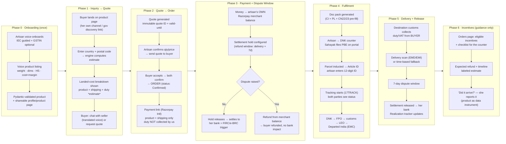
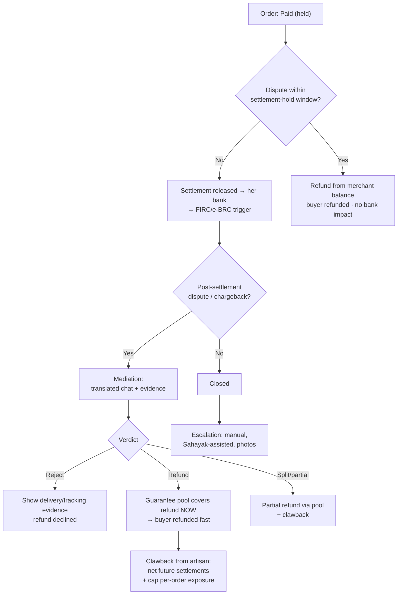

# Complete Flow — P2 Buyer Acquisition (DECIDED: Model 2, Artisan = Exporter of Record)

**Project:** SIH260113 — DNK Export Enablement · **Follow-up:** P2 Buyer Acquisition
**Date:** 2026-08-08 · **Status:** DESIGN DECISION (ideation phase — this is the flow the team builds against)
**Decision (user):** Money goes **straight into the artisan's account**. The **artisan is the exporter of record**. The platform is tooling + transaction guarantee — **never** the merchant of record, **never** the exporter.
**Consequence accepted:** FIRC/e-BRC mapping for PA-CB settlements to her account is **unverified** (flagged as O14/CA verification item). The demo labels it honestly.

---

## 0. Actors

| Actor | Role |
|---|---|
| **Buyer** | Foreign customer. Reaches the artisan via her own channel (WhatsApp/Instagram/diaspora) or via a government discovery platform (out of scope — assumed link). Lands on a shareable product/profile page. |
| **Artisan** | Seller + **exporter of record** (her own IEC). Vernacular-only, zero-inventory made-to-order. |
| **Platform (us)** | Tooling: voice onboarding, listing, quote engine, landed-cost, doc pack (pre-fill), payment-link facilitation, tracking aggregation, realization guidance, **dispute/refund guarantee** (backstop, not merchant). |
| **Dak Niryat Sahayak / DNK counter** | Physical execution: files PBE on the DNK portal (no API — app assists, does not file), inducts parcel, handles customs queries. |
| **Payment rail** | Razorpay International (PA-CB). Payment link is created under **the artisan's own merchant account**; platform configures the settlement hold. |
| **Tracking** | 17TRACK API aggregation of India Post / EMS / ITPS events (₹22/order — verify exact pricing). |
| **Destination customs/postal** | Assesses and **collects duty/VAT from the buyer at delivery**. Platform never collects or remits destination tax. |

---

## 1. End-to-End Flow

---

## 2. Phase Detail

### Phase 0 — Onboarding (once, voice-first, vernacular)
1. **Artisan registration:** voice-guided (Hindi/regional, ≤3 fields/screen, read-aloud). IEC via guided onboarding walkthrough (free under FTP 2023 — but requires PAN + firm bank account + address; the app explains and produces a "take to DGFT/DNK" checklist). **GSTIN optional** — never a blocking field (PBE accepts "Others"/Aadhaar carve-out on paper; migrated-portal enforcement unverified — O2).
2. **Product listing via voice assistant:** artisan describes the product; STT → structured draft (name, category, material, weight in grams, dimensions in cm, HS code assist with confidence, photos, make-time for MTO, base cost, desired margin). Voice confirms each field.
3. **Validation (strict — the pydantic layer):** see §5. Only validated products go live.
4. **Shareable pages:** each product + a profile page get public links (what a buyer from WhatsApp/gov-discovery lands on). No catalogue browsing UX needed (discovery is out of scope).

### Phase 1 — Inquiry → Quote
1. Buyer opens the product link → sees: product, base price (artisan cost + margin), and "enter your country / postal code for a shipping estimate."
2. **Engine computes** (deterministic, live config, no static numbers):
   - Lane: ITPS (actual-weight 50-g slabs, volume-free) vs EMS (250-g slabs, volumetric ÷4000/5000/6000 configurable) vs Air Parcel — by weight × dimensions × destination.
   - Steer rule: ≤2 kg bulky-light → ITPS (volume-free); per-destination weight caps enforced.
   - Destination duty/VAT: **estimate only**, from live config flags with source link + last-updated timestamp (US S.301 10%, UK 20% VAT, EU €3 flat, UAE 5% VAT, AU 10% GST, CA CAD 20, JP ¥10,000, SG SGD 400).
3. **Displayed breakdown** (the anti-mismatch surface):
   - Price to artisan: ₹X (fixed by her cost+margin)
   - Shipping: ₹Y (engine, buyer-address-dependent)
   - **Duty/VAT: ₹Z — "estimate, paid by you at delivery to your country's customs, not collected by us"** (transparency without becoming a duty collector)
4. Buyer can **Chat with seller** (translated voice chat; language auto-detected; response-SLA expectation shown to manage abandonment).
5. Buyer clicks **Request quote** → qty → **quote generated**: immutable `quote_id`, deterministic price (same inputs → same price; see §5 hash), `valid_until` date (duty volatility), currency displayed.

### Phase 2 — Quote → Order
1. Artisan sees quote request in her app (voice notification). She confirms qty and price (price editable only within engine bounds — prevents the mismatch), or declines.
2. **"Send quote to buyer"** → buyer receives a link (WhatsApp/email). The link loads **by quote_id** — the buyer sees exactly the same numbers as the request (no re-computation drift).
3. Buyer **accepts** → both parties confirm → **Order** created, status `Confirmed`.
4. **Payment link** generated (Razorpay International) for **product + shipping only**. Duty is explicitly excluded from the collected amount.

### Phase 3 — Payment + Dispute Window (the refund-critical design)
1. Payment lands in **the artisan's own Razorpay merchant balance** — NOT a platform account. It is "her money," already attributable to her for realization purposes.
2. Platform configures a **settlement hold** on her merchant account: funds stay in merchant balance until the refund window closes (delivery-confirmed + 7 days, with a late-arrival grace; cap configurable). Refunds are deducted **from merchant balance before settlement** — the buyer is refunded without the artisan's bank ever being touched, and without the platform holding funds.
3. Order appears on the artisan's Orders page with a clear state machine: `Confirmed → Paid (held) → In Transit → Delivered → Disputed? → Settled / Refunded`.
4. If no dispute: hold releases → money settles to her bank. **This settlement is the FIRC/e-BRC realization trigger** (mapped to her PBE/IEC via EDPMS — ⚠️ unverified, see §7).

### Phase 4 — Fulfilment (real-world execution)
1. Platform generates the **print-ready doc pack**: commercial invoice + packing list + CN22/23, pre-filled from the order, validated (Σ values, Σ weights, FOB ≤ invoice, HS codes). **This is a pre-fill aid — the PBE is filed by the Sahayak on the DNK portal (no API; the app assists, never files).**
2. Artisan goes to the DNK counter (or requests pickup), shows/prints the docs; **Sahayak files PBE-III/IV on the portal**, counter inducts the parcel → **Article ID** issued.
3. Artisan enters the 12-digit Article ID (or scans it) into the app → **tracking starts** (17TRACK aggregation) → both parties see live status in their language.
4. Parcel path: DNK → FPO → faceless customs (queries are handled by the Sahayak on the portal; the app notifies her — she does nothing technical) → **LEO** → dispatch → **EMC — "Departed India."**
5. **Postage cash-flow mitigation:** she pays the counter postage in cash (as today). The shipping amount she received is released early via a **partial settlement** on dispatch proof, so she's not out of pocket — or, simpler v1: the app shows "shipping ₹Y received — postage is covered," settled with the main hold. (Choose the partial-release option for the demo; flag the simpler one as fallback.)

### Phase 5 — Delivery + Release
1. Destination customs assesses duty/VAT → **collects from the buyer at delivery** (the app reminded her: "your buyer pays the duty — did they know?").
2. **Delivery scan** (EMD/EMI) OR **time-based fallback**: if no delivery scan by N days after dispatch (e.g., 21 days), the app flags the order and starts the escalation path (for the dispute subsystem) instead of silently waiting.
3. **7-day dispute window** opens at delivery confirmation.
4. No dispute → settlement released → her bank. **Realization tracker** updates: "export realized ₹X on [date] — e-BRC should generate via EDPMS" (⚠️ demo shows this as estimate/mock).

### Phase 6 — Incentives (guidance only — NEVER a filing button)
1. Orders page shows **eligible incentives** per order (IGST refund if GSTIN-holder; Drawback/RoDTEP if applicable and entitled) with a **checklist** for the counter/ICEGATE — not an app-side claim.
2. Expected refund amount + timeline shown, **labeled "अनुमानित / estimate"** (research: entitlement ≠ realization; aggregate realization narrow).
3. **"Did it arrive?"** — she reports the bank credit; the app logs it. **The product becomes the data-collection instrument** the research lacks (realization-rate evidence).

---

## 3. Refund & Dispute Subsystem (the designed core)

**Mechanics (in order of preference):**

1. **Pre-settlement refund (primary path):** refund = reversal from the artisan's merchant balance during the hold window. Buyer refunded by the rail; artisan's bank never involved; platform holds nothing. This is why "money goes straight to her account" and "we can refund the buyer" are **not contradictory** — the settlement hold on *her* account does the work.
2. **Post-settlement refund (money already in her bank):**
   - **Guarantee pool** (funded by a small per-order fee, e.g., 3–5% of sale, transparent): refunds the buyer immediately (buyer trust preserved) then **claws back** from the artisan by netting future settlements, with a **per-order exposure cap** (e.g., max 100% of one order's value) and explicit refund-liability terms she accepts at onboarding.
   - The pool is **platform risk, not platform revenue** — its balance is visible; the goal is to shrink it via the pre-settlement path.
3. **Returnless refunds below threshold:** for low-value parcels (e.g., ≤ ₹1,500 equivalent), refund without requiring return — return postage exceeds item value and the research documents returns as a thin-margin killer for handmade. Above threshold: attempt postal return (⚠️ India Post returns handling is opaque — flag as the weakest link; design around it with the threshold + insurance recommendation).
4. **Chargebacks (buyer disputes at card level):** rail-level dispute → platform defends with delivery/tracking evidence; if lost, refund via pool + clawback.
5. **Never-delivered / dead tracking:** after the time-based fallback expires with no delivery scan, auto-refund via pool + clawback, and report the lane/operator to 17TRACK for data-quality escalation.
6. **Ship-SLA:** buyer paid, artisan hasn't shipped within the SLA (e.g., 5 days) → auto-refund from merchant balance/pool. Prevents "paid and ghosted."

**Dispute flow for the buyer (in-app):** raise issue (not delivered / damaged / wrong item / not as described) + photos → translated mediation chat with the artisan → verdict: refund / partial / reship / reject-with-evidence. All timestamps and evidence logged (the product collects the dispute data the research lacks).

---

## 4. Trust Layer (buyer confidence WITHOUT being the merchant)

| Buyer fear | Mechanism |
|---|---|
| "Seller takes money and ghosts" | Ship-SLA auto-refund + settlement hold + guarantee-pool backstop |
| "Damaged/wrong item, no recourse" | 7-day post-delivery dispute window + returnless refund below threshold |
| "It's a random artisan, is this legit?" | Platform guarantee badge on the page ("delivery guaranteed or money back") + order-state transparency |
| "Duty surprise at delivery" | Duty/VAT **estimate** shown at quote with source link; "paid by you at delivery" stated upfront |
| "Currency/payment unknown" | Quote in buyer's currency; payment link from a licensed PA-CB (Razorpay International) |
| "No one to talk to" | Translated voice chat with the seller + the platform's own support channel |

**Anti-Amazon guardrails (what we deliberately do NOT do):** no discovery/catalogue browsing (out of scope), no merchant-of-record, no platform escrow account, no duty collection/remittance, no customer capture (artisan keeps the relationship — Anou-style governance: per-artisan sub-profiles, customer attribution back to her, she owns reorder channel).

---

## 5. Strict Validation Layer (the pydantic models)

**Product** (created via voice; validated on create AND on any edit):
- name (non-empty, ≤150 chars) · category (enum, top-50 handicraft seed) · material · photos ≥1
- weight_g > 0 · length_cm/width_cm/height_cm > 0 (volumetric math requires them)
- hs_code: 4–8 digits, plausibility check (top-50 assist, ≥90% target — O18)
- base_cost ≥ 0 · margin_pct 0–100 · make_time_days ≥ 0 (MTO)
- prohibited-category flag (wood/plants/ayurveda/food/liquids/magnets/lithium/cosmetics) — checked per destination at quote time

**Quote:** immutable `quote_id` · `created_at` · `valid_until` (duty volatility) · `price_hash` = SHA of (product, qty, buyer country, postal code, config version) — **the same inputs MUST hash to the same quote; any config change bumps the version and invalidates old quotes** (this is the answer to "how do we know the quote matches what the buyer saw").

**Order:** quote_id ref · line items (product, qty) · buyer country/address · price components (product / shipping / duty-estimate — displayed and stored separately) · currency · status enum (`confirmed → paid_held → in_transit → delivered → disputed → settled | refunded`) · dispute_state · timestamps · article_id (12-digit, set at induction).

**Validation rules (from the research's error-proofing — the #1 failure mode):**
- Σ piece values ≤ parcel value
- Σ piece weights ≤ parcel weight
- gross weight ≤ 110% of net
- **FOB ≤ invoice value**
- HS code required per piece (no vague descriptions)
- Lane-cap guard: parcel ≤ per-destination ITPS cap (2 kg US/AU/CA — cap contested 2 vs 5 kg, O10)

---

## 5A. Exporter Account Binding (the payout lock — single point of failure)

**Why this exists:** the e-BRC is **AD-code + IFSC + account-number specific**. At generation, the exporter enters her AD Code and the IFSC/account of realization auto-populate from the bank's IRM (DGFT eBRC manual: IFSC + account "will be auto-populated"; "IRMs of the same bank name can only be clubbed"). Razorpay auto-issues the e-FIRA per international payment — the base document for the e-BRC. **If the payout account ≠ the AD-code account on her IEC, the e-BRC silently generates against the wrong bank and every incentive claim fails.** This is a hard binding, not a soft warning.

**The three-part mechanism:**

1. **Onboarding lock.** Registration captures **IEC + AD Code (14-digit) + bank account (IFSC + account no.) + account-holder name** as one binding unit. Then:
   - Verify the IEC is real via the free DGFT **"View Any IEC"** service (returns IEC details, DEL status, customs/ICEGATE status — it does **not** return AD codes or bank, so the AD-code→bank link cannot be machine-verified here; see step 2).
   - Verify the bank account is real and in her name via the **payment rail's KYC** (Razorpay validates account-holder name against PAN/firm name during merchant onboarding — a *name match*, not an AD-code match).
   - Validate the AD Code's format (14-digit) and **display the AD-code bank name vs the payout bank name side by side** in the UI so a visible mismatch is caught by the human (her, the Sahayak, or the bank).

2. **Human confirmation gate (the un-verifiable step, honestly labeled).** No public lookup connects "AD code → bank account" or "IEC → AD code" — ICEGATE's AD-code registration is login-gated. So the app **cannot machine-verify** the link, and the design requires a **one-time confirmation at the source**:
   > "Take this checklist to your bank / the DNK Sahayak: confirm the account receiving export payments is the same account registered against your AD Code on ICEGATE. We'll only activate payouts once you mark this confirmed."
   This is a **confirmation gate, not a trust-me gate** — a 10-minute bank/Sahayak check, because the consequence of getting it wrong is total (no e-BRC, no incentives, FEMA non-compliance).

3. **Immutability + reconciliation tripwire (the enforcement).**
   - The payout account is **locked** once an order is placed. Changes require the **re-verification flow** (same checklist + new confirmation), with an audit trail.
   - **Different bank entered → hard block** with a vernacular explanation: *"यह खाता आपके IEC से लिंक AD Code के खाते से मेल नहीं खाता — इससे आपकी e-BRC और incentive claims नहीं बनेंगी।"* (This account doesn't match your AD-code account — your e-BRC and incentives will fail.)
   - **Post-settlement reconciliation:** when the payment settles, the app requests the **e-FIRA** (Razorpay auto-generates it) and matches three fields against the binding: **UTR/remitter, AD code used, IFSC of the receiving account.** IFSC on the e-FIRA ≠ bound IFSC → hard alert: "funds landed in an account different from your AD-code account — realization won't map to your export." **Freeze further payouts until resolved.**

**Demo beats:** (a) onboarding screen showing the binding unit with side-by-side bank names; (b) a scripted mismatch attempt — seller enters a different account → blocked with the vernacular warning; (c) reconciliation — e-FIRA matched against the bound IFSC → green "realization mapped ✓" (real in Razorpay sandbox).

---

## 5B. Order Confirmation & Payment State Machine (no manual marking — ever)

**Rule:** *money transitions come from the payment rail (automatic); physical transitions come from external proof (Article ID, tracking event); the seller confirms only what she physically does — ship.* **There is no "mark as paid" button anywhere.** If someone asks for one, the answer is no — that's the point.

| Order state | Trigger | Who/what confirms | Manual? |
|---|---|---|---|
| `quote_accepted` | Buyer accepts the quote link | Buyer (soft confirmation — not money yet) | Buyer taps Accept |
| **`paid_held`** | **Razorpay webhook `payment.captured` fires** | **The rail — automatic, no human** | **❌ Never manual** |
| `in_transit` | Artisan enters the 12-digit Article ID from the DNK counter | Artisan (she physically inducted the parcel — her *ship* confirmation, not a payment claim) | Artisan scans/enters |
| `delivered` | Tracking event (EMI/EMD) or time-based fallback | 17TRACK / rail | Automatic |
| `settled` / `refunded` | Settlement-hold expiry / dispute outcome | Platform logic | Automatic |

**Webhook flow:**
1. Buyer taps the payment link → pays on Razorpay's hosted page.
2. Razorpay sends **`payment.captured` webhook** → backend **verifies the signature** → update `quote_accepted → paid_held`.
3. Both parties' order pages update in real time: buyer sees "Paid ✓ / order confirmed," artisan sees "पैसा मिल गया — अब पैकेज भेजें" (payment received — now ship).

**The two confirmations (distinct — confusing them is the bug):**
- **Buyer confirms by paying.** Payment = strongest confirmation (money moved). Quote-accept is only the soft pre-step.
- **Artisan confirms by shipping** — entering the Article ID. That is her commitment: "I received payment and physically handed the parcel to DNK."
- "Both parties confirmed" = state `in_transit` (paid *and* shipped). Payment alone never confirms an order — which is what makes the ship-SLA auto-refund safe.

**Failure-mode safety net:**
- **Missed webhook:** reconcile — poll Razorpay's order-status API every N minutes and sync any missed `paid_held` transitions. Webhook = fast path, poll = truth path.
- **Idempotency:** the same webhook may arrive twice; transitions must be idempotent (receive `payment.captured` twice → still `paid_held`).
- **Payment-link expiry** (e.g., 48h): order returns to `quote_accepted`; a fresh link can be re-issued. No stuck state.
- **Failed payment** (`payment.failed` webhook): order shows "payment failed, try again" — no state change.
- **Amount mismatch:** webhook includes the amount; verify it equals the order total before marking paid. Mismatch → hold for review.

**Demo value:** this is one of the **few genuinely real integrations** — Razorpay sandbox fully supports webhooks + order-status API, so the demo is **real, not mocked**: buyer pays on the hosted page → within seconds the artisan's app shows "paid" with no human touching anything.

---

## 5C. Document Attainment & Onboarding (sign-and-go — she never does paperwork)

**Rule:** *she doesn't do the paperwork. She does sign-and-go. Someone else (Sahayak, banker, co-op) executes the forms; the app sequences, generates, and tracks them; and it only fires when there is a paid order motivating it.*

### The minimal mandatory document set (NOT the full research stack)

The research's "full stack" (IEC + GSTIN + AD Code + ICEGATE + UDYAM + RCMC) is the worst case. For Model 2, the minimal set is **4–5 items, all free, doable in 1–2 bank/DNK visits — with assistance**:

| Document | Mandatory? | Real friction for her | Difficulty |
|---|---|---|---|
| **PAN** | Yes (IEC + payment-rail KYC) | Most adults have one; free to get | Low |
| **Bank account in her name** | Yes | She has one (savings). ⚠️ Banks may require a **current account** for export receipts — the #1 hidden friction, surfaced as **Step 0** | Medium |
| **IEC** | Yes | Free (FTP 2023), same-day digital for simple proprietorships; DGFT may physically verify address | Low–Med, assisted |
| **AD Code** | Yes (e-BRC/incentives) | Requires **bank confirmation** — a bank visit with correct paperwork | **High — the real gate** |
| **ICEGATE registration** | Yes | Free; use **Aadhaar e-sign OTP** instead of buying a DSC (no digital certificate purchase) | Low–Med, assisted |
| GSTIN | **No** (legally optional) | Skip. (Caveat: no GSTIN = no IGST refund; Drawback/RoDTEP still possible) | — |
| UDYAM / RCMC / DSC | **No** (FTP-benefits-only) | Skip | — |

### The four levers that make her actually do it

1. **Order-first sequencing (motivation engine):** registration never happens "just in case." Sequence: inquiry → quote → **buyer pays** → export registration fires. A paid order in hand is the strongest motivation a ₹7,000/month artisan can have. The payment rail's KYC (PAN + bank, app-guided) is the *first* document gate — Razorpay processes it, and it's what makes the order real.
2. **The Sahayak executes; she signs:** the app produces a **registration kit** — prefilled IEC form + prefilled AD-code form + one-page vernacular checklist + a voice "what happens next" explainer. She takes her phone to the DNK counter or bank; **the Sahayak/banker fills the forms; she just OTPs/signs.** Her job per document = "go, sign, done." (Concretizes parent research FR-011.)
3. **Zero money, zero forms in her hands, one screen per step:** everything free; she never sees a DGFT/ICEGATE form; one voice screen per step — "Step 2 of 4: your IEC. Take this phone to the counter on [day]. The assistant will do it. You sign with OTP."
4. **Readiness scoreboard (person, not document):** "आप निर्यात के लिए 2 कदम दूर हैं" (you're 2 steps from export-ready). Each completed step unblocks the order. The buyer sees a normal checkout — nothing.

### Readiness routing (the honest segment boundary)

A 2-question onboarding check ("do you have a PAN? a bank account?") routes her:

- **Has PAN + bank account → individual path** (sign-and-go, above).
- **Has neither → collective path:** the SHG/co-op (already formed, already holds IEC/AD-code) is the exporter; she's a member; the app supports the *collective's* workflow instead of hers. (Evidence: H3/F3 — collectives are the proven converting unit for exactly this segment: STFC, Charaka, eSaras.)

Both paths share the same orders/payment/tracking core — this is a routing decision, not a fork in the build.

### The one real friction left

**Current-account requirement for export receipts:** if her savings account can't receive the settlement, that's a bank-conversion step — surfaced in onboarding as **Step 0** with the checklist, never discovered at settlement time.

---

## 6. What's Real / Mock / Unverified (honesty table — non-negotiable)

| Component | Status | Note |
|---|---|---|
| Landed-cost engine (postage slabs + duty flags + volumetric) | ✅ **REAL** | Pure computation, live config, no API |
| Quote immutability + price hash | ✅ **REAL** | Deterministic |
| Voice onboarding / product listing / translated chat | ✅ **REAL** | STT/TTS, language detection |
| Doc pack generation (CI/PL/CN22/23) | ✅ **REAL** (pre-fill only) | Never files the PBE |
| Tracking aggregation (17TRACK) | ✅ **REAL** | ₹22/order — verify exact pricing/coverage for India Post intl |
| Payment link + settlement hold (Razorpay sandbox) | ✅ **REAL (sandbox)** | Attempt O14 onboarding |
| Webhook-driven order state machine (`payment.captured`, reconciliation poll, idempotency) | ✅ **REAL (sandbox)** | Razorpay sandbox supports webhooks + order-status API — demoable live, not mocked |
| Exporter account binding (IEC + AD Code + bank) + mismatch block + e-FIRA reconciliation | ✅ **REAL (app logic)** | DGFT "View Any IEC" + rail KYC are real; AD-code↔bank link is a human confirmation gate (§5A) |
| Sign-and-go onboarding kit (prefilled IEC/AD forms + checklist + readiness routing) | ✅ **REAL** | App generates; Sahayak/banker executes (§5C) |
| State machine / orders page / dispute UI / guarantee-pool ledger | ✅ **REAL** | Internal |
| PBE submission, customs clearance status | 🔴 **MOCK** | No public API — label "मॉक / mock" |
| ICEGATE / EDPMS / e-BRC status | 🔴 **MOCK / ESTIMATE** | No public API — label |
| **FIRC/e-BRC mapping for PA-CB settlement to her account** | ⚠️ **UNVERIFIED** | The O14/CA question. If settlement to her own Razorpay account does NOT cleanly generate her e-BRC for postal PBEs, fall back to: rail-level FIRC provided by Razorpay → CA mapping checklist (FR-043), and the demo shows the mapping step explicitly. |
| Incentive claim submission | 🔴 **GUIDANCE ONLY** | Never an app-side claim button |

---

## 7. Edge Cases & Open Verification Items

**Edge cases handled in design:**
- Buyer pays, artisan never ships → ship-SLA auto-refund (merchant balance → pool)
- Duty estimate changes mid-flight (US regime) → quotes expire via `valid_until` + config version bump; buyer warned "estimate"
- Volumetric blow-up on EMS → engine steers to ITPS; if forced EMS, explicit warning before quote
- Prohibited item to a destination (wood→Ireland) → quote blocked at destination check; if caught late, refund path
- Multi-product order → combined-parcel validation (Σ values/weights), per-line HS, lane decided on the parcel
- FX/currency → quote in buyer currency, settlement in INR, spread shown in breakdown
- Buyer never confirms → quote auto-expires
- Tracking dead after dispatch → time-based fallback → escalation + auto-refund path

**Open verification (before/at build — do NOT claim these in the demo as real):**
1. **O14/Razorpay:** Does the artisan's own Razorpay International account accept inbound cross-border payment links and hold settlements per-order? Does settlement to her bank generate a FIRC the CA can map to her postal PBE (→ her e-BRC)?
2. **O14b / AD-code link:** Confirm the "human confirmation gate" in §5A is sufficient at the bank/Sahayak level — i.e., the bank can actually confirm "AD code ↔ account" in one visit (if not, extend the gate to a bank letter). Also confirm DGFT "View Any IEC" is usable programmatically (point lookups; check terms for app use).
3. **O2:** Migrated DNK portal — does IEC-only (GSTIN-less) PBE booking actually complete?
4. **O10:** ITPS US weight cap — 2 kg or 5 kg?
5. **17TRACK:** India Post international event coverage + "departed India" (EMC) reliability — determines whether the 60% partial-release trigger needs a time fallback.
6. **Postal returns:** reverse-export returns handling (weakest link — design threshold + insurance around it).

---

## 8. What This Flow Does NOT Do (explicit scope boundaries)

- ❌ No discovery / catalogue browsing / buyer acquisition — out of PS scope (government platform assumed to link in)
- ❌ No merchant-of-record / platform escrow account / duty collection / tax remittance
- ❌ No PBE filing, no ICEGATE/EDPMS/e-BRC filing — assist/guide/mock only
- ❌ No "claim incentives" button — guidance + checklist + realization tracking only
- ❌ No customer capture — artisan keeps the relationship (anti-Amazon by design)
- ❌ **No manual "mark as paid"** — payment confirmation is webhook-driven from the rail only (§5B)

---

*Design decision recorded 2026-08-08. Supersedes the hybrid model previously discussed. The exporter-of-record question is RESOLVED (Model 2); the FIRC/e-BRC mapping is the one flagged risk that a CA/Razorpay verification must close before the demo can claim real realization flow.*
